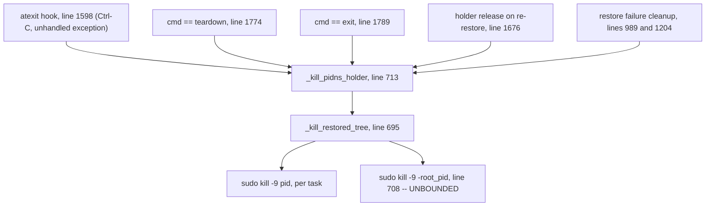

# Teardown kill scoping (reduced-capability restore)

Status: root cause identified, fix designed and **implemented**.

`_kill_restored_tree` ended with what was meant to be a process-group SIGKILL.
procps-ng `kill(1)` does not parse it as one: a multi-digit negative pid is
consumed as an option cluster and the target is derived from its first digit
alone, so `sudo kill -9 -1181` ran `kill(-1, SIGKILL)`. As root that is every
process it may signal. It killed the worker executing it and PID 1's only
child, which ends the container and consumes a `backoffLimit` retry. It fires
on **normal teardown**, not only on Ctrl-C.

This affects the reduced-capability (`SEMIP_UNPRIVILEGED=1`) path only. See
Section 4 for why it is fatal for the tp2 tree and inert for the weights trees.
That split is **not** about TP size: it is the first digit of the restored root
pid, so a TP=1 image that happened to restore at a pid beginning with `1` would
collapse the pod just as reliably.

This document is the full incident record. The condensed version lives as
*Complication 13* in [`CRIU_PLUMBING.md`](CRIU_PLUMBING.md), with the one-line
rule in [`SKILL.md`](SKILL.md)'s gotchas: never shell out to `kill` with a
negative pid.

---

## 1. Symptom

Running `scripts/test_tp2.py` to completion kills every process in the pod: the
vLLM tree, the worker, the driving script, and the interactive shell. Before the
`keepalive()` mitigation (Section 13) it also killed PID 1's `sleep`, which
exited the container with code 137 and burned one of six `backoffLimit` retries.

`mert-cap-prod-ptrace-2` exhausted all six retries on 2026-09-05 and was
terminated by Kubernetes at 21:38:41 with
`reason: BackoffLimitExceeded`. The pod was deleted and its 8 H200s returned to
`research-systems-h200`.

## 2. Evidence

**It is not the OOM killer.** The container's `memory.events` reported
`oom_kill 0`, kubelet never reported `OOMKilled` (the status was `reason: Error,
exitCode: 137`), and `sudo dmesg` contained no OOM records at all. Exit 137 is
SIGKILL, so something issued an explicit `kill -9`.

**It is not `recapture_graphs`.** That primitive does fail intermittently and is
tracked separately; the collapse reproduces on a run where
`<<< recapture_graphs OK (6.217s)` and `<<< generate ... OK` both succeeded.

**The teardown logs localise it to one function.** The two scripts produce
identical teardown sequences that diverge on the last two lines.

`test_weights.py`, instance 1, TP=1, restored root 3111 -- completes:

```
22:38:49.453 worker.py:1604  >>> teardown
22:38:49.457 worker.py:1485  <<< teardown OK (0.003s)
22:38:49.457 worker.py:1554  child thread done
22:38:49.477 worker.py:710     restored tree killed (root host_pid=3111)
22:38:49.477 worker.py:1802  exiting
```

`test_tp2.py`, instance 0, TP=2, restored root 1181 -- stops dead:

```
22:41:38.466 worker.py:1604  >>> teardown
22:41:38.472 worker.py:1485  <<< teardown OK (0.006s)
22:41:38.473 worker.py:1554  child thread done
                             (nothing further: no "restored tree killed", no "exiting")
```

`worker.py:710` is the `log.info` on the line *after* the group kill. tp2 enters
`_kill_restored_tree(1181)` and never returns from it: the worker (PID 11192) is
killed by the sweep it is itself running. Because the old code logs *after*
killing, the record of what it targeted is destroyed along with the worker --
which is what made this hard to attribute.

**Independent corroboration that the blast escaped the tree.** Immediately after
that teardown, PID 1's keepalive child had been replaced: `sleep 86400` was PID
11473 with 1:11 elapsed while PID 1 had been up 1:00:10. The tree's own tasks
are 1181/2103/2104. A kill confined to the tree cannot touch a child of PID 1 in
process group 1.

**No other code can do this.** A tree-wide grep for `pkill`, `killall`,
`killpg`, and negative-pid signals found exactly one negative-pid signal in the
entire package: `worker.py:708`. Every other kill site targets a single positive
pid (`_kill_process_tree` at 166, `instance.py:194`).

## 3. Root cause

Line numbers in Sections 1-5 and 8 refer to the **pre-fix** file, as a record of
the incident. Current locations are in Section 9.

`arctic_inference/semi_persistence/worker.py`, lines 695-710:

```python
def _kill_restored_tree(root_pid, log=None):
    if not root_pid:
        return
    for p in _get_descendant_pids(root_pid) + [root_pid]:
        subprocess.run(["sudo", "kill", "-9", str(p)], capture_output=True)
    subprocess.run(["sudo", "kill", "-9", f"-{root_pid}"], capture_output=True)  # line 708
    if log is not None:
        log.info("  restored tree killed (root host_pid=%s)", root_pid)
```

Line 708 signals a **negative** pid, intending the restored tree's process
group. It never reaches `kill(2)` that way. `/usr/bin/kill` is procps-ng 4.0.4,
which parses arguments with `getopt_long` under `opterr=0`, so `-1181` is
consumed as an *option cluster* and never reaches the pid-operand loop. Its
handler for that case derives the target from the first digit alone:

```c
case '?':
    if (!isdigit(optopt)) { ... } else {
        /* Special case for signal digit negative PIDs */
        pid = (long)('0' - optopt);
        if (!execute_kill((pid_t) pid, signo, use_sigqueue, sigval))
```

`optopt` is `'1'`, so `pid = '0' - '1' = -1` and the call becomes
`kill(-1, SIGKILL)` -- "SIGKILL every process the caller may signal." The
remaining digits are silently discarded. This is a long-standing procps bug
(Ubuntu #1637026, which used to wipe Hadoop nodes the same way).

PID 1 survives because a PID namespace's init ignores signals with default
actions sent from inside the namespace, which is exactly why `bash` lived long
enough to report `line 9: 767 Killed sleep infinity` rather than dying silently.

Line 708 exists deliberately. Its docstring explains why: `criu restore -d`
detaches the tree, so tasks reparent onto PID 1 and escape the
`_get_descendant_pids` walk on the line above. The group kill was the mechanism
for recovering them. A negative pid is unbounded by construction, so it recovers
them at the cost of an unbounded blast radius.

### Every teardown path funnels through it

`_kill_pidns_holder` (line 713) is the sole caller of `_kill_restored_tree`
(line 729), and is reached from five places. Fixing one function fixes all five.



Ctrl-C is only the `atexit` entry. `test_tp2.py` and `test_weights.py` both end
in `teardown()`, so a fully successful run reaches line 708 with no interrupt
involved. Six retries burned in 2.5 hours is far more consistent with normal
teardowns than with six deliberate interrupts.

## 4. Why tp2 collapses and weights does not

From `crit decode -i pstree.img` on the two images:

- `image-cache/tp2test/qwen_35b/image` -- three leaders, one shared group:
  - `pid=1181 ppid=0 pgid=1181 sid=1181 threads=482`
  - `pid=2103 ppid=1181 pgid=1181 sid=1181 threads=200`
  - `pid=2104 ppid=1181 pgid=1181 sid=1181 threads=233`
- `image-cache/qwen_27b/image` -- `pid=3109 pgid=3109 sid=3109 threads=593`
- `image-cache/qwen_35b/image` -- `pid=3111 pgid=3111 sid=3111 threads=562`

Both images are well formed: `pgid == sid == root pid`, and neither records a
`pgid` or `sid` of 1. Group membership is **not** the difference, and neither is
TP size. Because procps derives the target from the first digit of the root pid
(Section 3), the only thing that matters is which digit that is:

| Image | Root pid | `'0' - optopt` | Actual call | Outcome |
|---|---|---|---|---|
| `tp2test/qwen_35b` | 1181 | `'0' - '1'` | `kill(-1, SIGKILL)` | every process root may signal |
| `qwen_27b` | 3109 | `'0' - '3'` | `kill(-3, SIGKILL)` | ESRCH, process group 3 does not exist |
| `qwen_35b` | 3111 | `'0' - '3'` | `kill(-3, SIGKILL)` | ESRCH, process group 3 does not exist |

So `test_weights.py` has never collapsed for one reason only: its images happen
to restore at pids beginning with `3`, and process group 3 is empty. Its worker
therefore survives to log `restored tree killed (root host_pid=3111)`.
`test_tp2.py` restores at 1181 and takes the whole container down.

Confirmed on the node with signal 0, which delivers nothing. That branch of
procps has inverted exit logic (`if (!execute_kill(...)) exitvalue =
EXIT_FAILURE`), so `rc=1` means the `kill()` **succeeded**:

```
$ kill -0 -1181     ; echo $?   # 1 -- succeeded, so the target was -1
$ kill -0 -3111     ; echo $?   # 0 -- ESRCH, so the target was -3
$ kill -0 -- -1181  ; echo $?   # "No such process": pgid 1181, once -- protects it
```

Corollary: no restored root pid is safe. A TP=1 image restoring at, say, 1234
would collapse the pod exactly as tp2 does.

## 5. Resolved: how the signal escaped group 1181

This section previously recorded an open question -- a literal `kill -9 -1181`
should be confined to group 1181, so either `root_pid` was not 1181 by the time
line 708 ran, or the argument was not passed through as intended. It is the
second: `root_pid` is 1181 throughout, and procps-ng discards all but its first
digit (Section 3).

A clean reproduction on 2026-09-05 at 22:58:29 settles it. `test_tp2.py` ran to
completion -- `recapture_graphs OK (6.292s)` and `generate ... OK` both -- then:

- `/tmp/inst1.log` (TP=1, root 3111, worker 14198) finishes normally:
  `restored tree killed (root host_pid=3111)` then `exiting`.
- `/tmp/inst0.log` (TP=2, root 1181, worker 14797) stops dead after
  `child thread done`, with neither line reached.
- The entire process table was wiped at that instant. PID 1's keepalive `sleep`
  was replaced (new pid 15197, started 22:58:28) and every other process in the
  container -- the driving script, the cursor-server tree, unrelated
  interactive shells -- was gone. Only PID 1 survived.

A kill confined to any single process group cannot do that. Surviving PID 1
plus nothing else is the signature of `kill(-1, SIGKILL)`, which is exactly
what Section 3 shows procps issues.

This also means the earlier framing "fatal for TP>1, inert for TP=1" was
coincidence, not mechanism. See the table in Section 4.

## 6. Node constraints (measured, do not re-derive)

Measured on `mert-cap-prod-ptrace-2-0-zlxxt`:

- Kernel `6.12.92-122.166.amzn2023.x86_64`, `/sys/fs/cgroup` is `cgroup2fs`.
- `cgroup.kill` **exists**. It is the ideal mechanism: write `1` and the kernel
  atomically SIGKILLs exactly that cgroup's members, immune to pid reuse.
- It is **unusable here**: `/sys/fs/cgroup` is mounted `ro` and is not writable
  even via `sudo`, so no child cgroup can be created.
- `cap_sys_admin` is **absent** from the bounding set, so the mount cannot be
  remounted `rw` and `sudo unshare --pid --fork true` fails with EPERM. This is
  the same constraint that forced the lowcap path to exist.
- Granted: `cap_chown, cap_dac_override, cap_fowner, cap_fsetid, cap_kill,
  cap_setgid, cap_setuid, cap_setpcap, cap_net_bind_service, cap_net_raw,
  cap_sys_chroot, cap_mknod, cap_audit_write, cap_setfcap,
  cap_checkpoint_restore`.
- `os.pidfd_open` is available.

Note: `cap_sys_ptrace` is **not** granted, despite this module documenting the
floor as `CAP_CHECKPOINT_RESTORE (+ CAP_SYS_PTRACE)`. It works because ptracing
same-uid processes needs no capability, so the real floor is lower than written.
Worth correcting in `CRIU_PLUMBING.md` separately.

Conclusion: kernel-enforced scoping is unavailable on this path. Scope in
userspace by enumerating membership and verifying every victim.

## 7. Design

Capture identity at **restore** time, while every task is known-live, then at
teardown kill only verified positive pids. Never signal a negative pid.

Two properties defeat pid reuse. First, membership is snapshotted when the tree
is known good, not inferred at teardown when `root_pid` may already be dead and
its id recycled. Second, every candidate's `starttime` from `/proc/<pid>/stat` is
compared against the snapshot -- a recycled pid always reports a strictly later
start time, so it is skipped.

Killing a leader reaps its threads, so the victim set is leaders only. That also
frees the whole recorded task-id range the collision preflight
(`_pid_collision_report`) cares about.

## 8. Implementation

Insert alongside the existing collision helpers, above `_kill_restored_tree`:

```python
def _proc_starttime(pid):
    """Field 22 of ``/proc/<pid>/stat``: the task's start time in clock ticks.

    Paired with a pid this is an identity that survives pid recycling -- a
    recycled pid always reports a strictly later start time.  ``comm`` (field
    2) can contain spaces and parens, so parse after the last ')': index 0 is
    then field 3, which puts starttime at index 19.
    """
    try:
        with open(f"/proc/{pid}/stat") as f:
            return int(f.read().rsplit(")", 1)[1].split()[19])
    except (OSError, IndexError, ValueError):
        return None


def _tree_identity(root_pid):
    """Snapshot a restored tree while every task is still known-live.

    Teardown then never has to infer membership from ids that may since have
    been reused.  That matters on this path specifically: the lowcap restore
    places tasks in the shared number space, so its ids do get recycled.
    """
    ident = {"kind": "tree", "pid": root_pid,
             "start": _proc_starttime(root_pid), "members": {}}
    try:
        ident["sid"] = os.getsid(root_pid)
    except OSError:
        ident["sid"] = None
    for p in _get_descendant_pids(root_pid) + [root_pid]:
        st = _proc_starttime(p)
        if st is not None:
            ident["members"][p] = st
    return ident
```

Replace `_kill_restored_tree` (lines 695-710) entirely:

```python
def _kill_restored_tree(ident, log=None):
    """SIGKILL exactly the tasks of a CRIU-restored tree, and nothing else.

    Used by the reduced-capability restore path, which has no PID namespace to
    collapse.  The restored tasks are root-owned (restored via ``sudo criu``),
    so kills go through ``sudo``.

    This must never signal a negative pid.  The previous implementation ended
    with ``kill -9 -<root_pid>`` to catch tasks that had reparented away from
    the root; procps-ng ``kill(1)`` derives its target from the first digit of
    that argument alone, so it ran ``kill(-1, SIGKILL)``, which as root is
    every process it may signal.  It killed the worker mid-sweep and PID 1's
    only child with it, ending the container.  Membership is enumerated
    explicitly instead, and every victim is matched against the restore-time
    snapshot so a recycled pid is never hit.
    """
    if not ident:
        return
    root_pid = ident.get("pid")
    if not root_pid or root_pid <= 1:
        if log is not None:
            log.error("  refusing to kill restored tree: bogus root pid=%r",
                      root_pid)
        return

    protected = _own_ancestry()
    members = dict(ident.get("members") or {})
    # Anything forked since the snapshot that is still parented under the
    # root, but only while the root is provably still ours: a pid picked up
    # by the live walk carries no snapshot start time to check against, so
    # were the root recycled this would enumerate an impostor's children.
    root_start = ident.get("start")
    live_root = _proc_starttime(root_pid)
    if live_root is not None and root_start in (None, live_root):
        for p in _get_descendant_pids(root_pid) + [root_pid]:
            members.setdefault(p, _proc_starttime(p))

    victims = []
    for pid, start in members.items():
        if pid <= 1 or pid in protected:
            continue
        live = _proc_starttime(pid)
        if live is None:
            continue                      # already gone
        if start is not None and live != start:
            continue                      # pid was recycled: not our task
        victims.append(pid)

    # Log BEFORE killing.  The old code logged after, so when the sweep took
    # out this worker the record of what it targeted was lost with it.
    if log is not None:
        log.info("  killing restored tree root=%s victims=%s",
                 root_pid, sorted(victims))
    for pid in sorted(victims, reverse=True):     # leaves first
        subprocess.run(["sudo", "kill", "-9", str(pid)], capture_output=True)
```

`_own_ancestry()` already exists at line 625 and needs no changes. It walks
`PPid` from `os.getpid()` up to PID 1 and includes it, so it protects this
worker, the driving script, and PID 1 in one set. The explicit `pid <= 1` check
is belt-and-braces for the case where a mid-walk read fails and drops PID 1.

The guard on the live descendant walk is what makes the recorded `start` field
load-bearing. Members carried over from the snapshot are each checked against
their recorded start time, but a pid discovered by the walk has no recorded
value to check against, so it would be trusted on sight. Running the walk only
while the root itself still matches its snapshot closes that gap: if the root
has died and its id been reused, teardown falls back to the recorded member set
alone and kills nothing that is not provably ours.

## 9. Call-site changes (as landed)

Post-fix line numbers:

| What | Line | Change |
|---|---|---|
| `_proc_starttime` | 672 | new |
| `_tree_identity` | 687 | new |
| `_kill_restored_tree` | 733 | rewritten, takes the identity dict |
| `_kill_pidns_holder` | 808 | passes the whole dict, not `holder.get("pid")` |
| `_worker_criu_load_lowcap` | 1276 | `holder = _tree_identity(new_pid)` |
| holder-shape docstrings | 794, 1123 | describe the identity dict |

No other call site changes. The namespace path's tuple holder
`(pid1_host_pid, popen)` is untouched: it kills one positive pid (the
namespace's init) and lets the kernel collapse the namespace, which is bounded
by construction and already correct.

No backward-compatibility shim is needed, and none was added. The holder is an
in-memory object built and consumed inside a single worker process -- never
pickled, queued, or written to disk -- and nothing calls `importlib.reload`. So
a worker that started before the edit runs the whole old module consistently
(the shim could not have helped it anyway, since it also has the old line 708),
and a worker that starts after gets the new producer and consumer together. No
path mixes the two shapes. Keeping a single input contract also means the
`root_pid <= 1` and start-time guards cannot be bypassed by passing a bare pid.

## 10. Invariants

Each of these independently prevents the outage. Keep them as explicit checks.

1. Never signal a negative pid. No `killpg`, no `kill -- -N`, no `f"-{pid}"`.
   Two independent reasons: a negative pid is unbounded by construction if it
   ever reaches `1`, and on this image it does not even mean what it says --
   procps-ng `kill(1)` silently rewrites a multi-digit negative pid to its
   first digit. A group kill that genuinely had to happen would need
   `os.killpg` (a direct syscall, no CLI parsing) or at minimum a `--`
   separator, and would still need its own bound on the target.
2. Never signal PID 1, or any ancestor of the calling process.
3. Refuse to act when `root_pid <= 1`.
4. Reject any candidate whose `starttime` does not match the snapshot.
5. Log the victim list before killing, never after.

## 11. Test plan, and what it reported

Run `python3 -m py_compile worker.py` first. This file is the **live import for
both pods** (Section 13), so a syntax error breaks `mert-cap-prod-ptrace` as
well. Keep a backup outside the repo before editing.

Then test behaviour without vLLM or a restore. Build a throwaway multi-leader
tree that mimics the tp2 shape -- own session, children sharing the leader's
group -- snapshot it, kill it, and assert the blast stayed inside:

```bash
setsid bash -c 'sleep 300 & sleep 300 & sleep 300' &
```

Record PID 1's `sleep` pid and the shell's own pid, call
`_kill_restored_tree(_tree_identity(<leader>), log)`, then assert: all three
`sleep 300` are gone; PID 1's keepalive child is unchanged; the calling shell is
alive; and the log line names exactly the expected victims. Under the old code
the keepalive child is replaced and the caller dies. Worth injecting two extra
members while you are there -- the caller's own pid, and a live pid carrying a
bogus start time -- and asserting both are filtered out, since that is invariant
2 and invariant 4 checked directly. Note that the leader is a direct child of
the test process and nothing reaps it, so treat state `Z` as dead or the last
assertion fails spuriously.

Finally run `scripts/test_tp2.py` end to end. Success criteria: the terminal
survives teardown, `/tmp/inst0.log` ends with `killing restored tree root=1181
victims=[1181, 2103, 2104]` followed by `exiting`, PID 1's `sleep` elapsed time
still tracks PID 1's uptime, and `kubectl get pod` shows an unchanged restart
count. Also confirm no vLLM process or GPU memory is left behind.

**Result, 2026-09-05 23:18:10.** All of the above passed. `/tmp/inst0.log`:

```
23:18:10.435 worker.py:1634  child thread done
23:18:10.436 worker.py:786     killing restored tree root=1181 victims=[1181, 2103, 2104]
23:18:10.457 worker.py:1882  exiting
```

The victim list is exactly the three leaders `crit decode` records for the
image, the worker survives its own sweep to log `exiting`, PID 1's keepalive
child stayed pid 15197 from 22:58:28 across the run rather than being replaced
at the teardown second, and no vLLM process or GPU memory was left behind. A
grep for `killpg`, `os.kill(-`, and `f"-{...pid}"` across the package now
returns nothing; every remaining kill site passes a positive pid.

## 12. This requires no re-dump

Every change reads live `/proc` after a restore has already succeeded. Image
format, `pstree.img`, and `meta.json` are untouched, so existing
`qwen_27b` / `qwen_35b` / `tp2test` images stay valid and verification is a cache
hit rather than a cold start. See `semi-p_DESIGN.md` for what does bind an image.

Session-based scoping was considered and rejected for exactly this reason: it
would depend on the dump having given the tree its own session, and this module
notes that only images from the updated dump path do so. Anchoring on the
recorded pid set removes that dependency.

## 13. Deployment

Both of these are symlinks to the same file on shared Lustre:

```
/data-fast/semi_persistence                             -> /code/users/mert/ArcticInference/arctic_inference/semi_persistence/
/usr/local/lib/python3.12/dist-packages/arctic_inference/semi_persistence -> /code/users/mert/ArcticInference/arctic_inference/semi_persistence
```

Consequences: editing the file **is** editing the live import, with no sync
step; the change takes effect on **both pods at once**; and it survives pod
deletion, because `/code` is the `fsx-research` Lustre PVC and not a per-pod
`emptyDir`. It is a git checkout on branch `staging/semi-p-post-release` where
`worker.py` was clean before this change, so the fix is the only diff in it and
is currently uncommitted.

The `keepalive()` loop now in `cap_prod_ptrace-2.yaml` is **containment, not the
fix**. It replaces `sleep infinity` so PID 1 does not exit when its child is
killed:

```yaml
keepalive() { while :; do sleep 86400 & wait $!; done; }
```

`bash` stays PID 1 (immune to SIGKILL from inside the namespace) and stays
blocked in `wait`, which also reaps CRIU-detached orphans and frees their pids
for `clone3(set_tid)`. Verified by firing `sudo kill -9 -1` in the pod: the exec
session died with 137, the pod stayed Running with 0 restarts, and PID 1 spawned
a replacement `sleep`. Keep it after the fix lands; it is cheap insurance.

Note `mert-cap-prod-ptrace` still runs the original `sleep infinity` command and
sits at 3 of 6 retries. Because the code fix lands on both pods at once it is no
longer exposed to *this* bug, but it has no containment left if anything else
ever kills PID 1's only child, so it is still worth resubmitting with the
`keepalive()` loop.

## 14. Out of scope

- **`_kill_process_tree` (line 166)**, called at 1415, 1560, 1769, 1852, 1867.
  Never signals a negative pid, so it cannot end the container, but it resolves
  descendants via `psutil` with no `starttime` validation and can SIGKILL a
  recycled pid. Same class, lower severity. Applying `_proc_starttime` and
  `_own_ancestry()` here is the natural follow-up.
- **`instance.py:194`**, `os.kill(self._worker.pid, signal.SIGKILL)` in
  `_reset()` after a 10s join timeout. A single positive pid from a live
  `mp.Process` handle, so the safest of the three, but also unvalidated.
- **Privileged path stale-reaper sweep** (in `_worker_criu_load`). Reads
  `reaper.pid` from the image dir and `sudo kill -9`s it, guarded only by `> 1`
  and `/proc/<pid>` existing. That file persists on shared storage while pids
  restart low in a fresh container, so it can name an unrelated live process.
  Not unprivileged-specific. Fix by recording a `starttime` beside the pid and
  refusing the old bare-pid format.
- **Optional: a guarded session sweep.** The strict design above misses tasks
  that reparent off the root *and* were not in the snapshot. A second pass over
  `/proc` selecting `os.getsid(pid) == ident["sid"]` would recover them, but
  only under three guards: `sid > 1`, `sid != os.getsid(0)`, and
  `starttime >= ident["start"]`. The middle guard is essential -- without it, if
  a tree ever shares the worker's session, an `inst0` teardown would select
  sibling `inst1` workers. Left out by default because the recorded pid set plus
  the live descendant walk covers every case observed so far.
- **`recapture_graphs` intermittent failure.** Seen in the 22:39 run, which died
  at `recapture_graphs(reuse) across 2 worker(s)` with no `<<<` completion.
  Unrelated to kill scoping and tracked separately.
